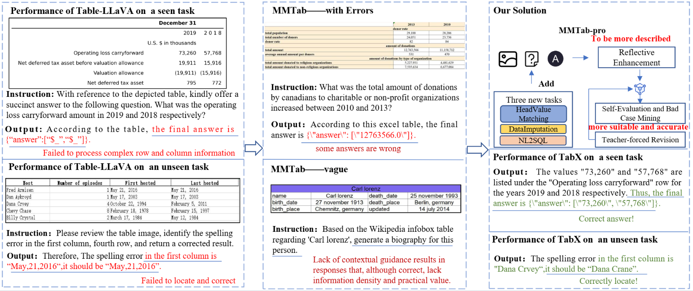

# TabX: X-cellent at Complex Tables and Beyond

---

## 1. Introduction



Tables serve as a crucial medium for representing structured information and are widely used in domains such as finance, e-governance, and scientific research. However, table understanding remains a challenging task due to complex layouts, hierarchical structures, and the diversity of task formats. While recent multimodal large language models (MLLMs), such as Table-LLaVA, have shown promise in handling table images, they often suffer from limited generalization to complex or unseen tasks and rely on low-quality instruction data.

To address these challenges, we propose **TabX**, a robust and generalizable table MLLM. TabX introduces two key components: (1) a **reflective enhancement strategy** for dataset construction, which augments existing multimodal table datasets with three newly designed challenging tasks and leverages a teacher-student reflection mechanism to produce high-quality instruction-table-answer triplets, forming the **MMTab-Pro** dataset; and (2) a **Self-Evolution with Teacher-Tuning (SETT)** framework that enables collaborative evolution between the model and the data throughout the instruction tuning process. Built upon Janus-Pro, a strong vision-language foundation model trained on both generation and understanding tasks, TabX benefits from enhanced comprehension of table images.

Experimental results on the MMTab-eval benchmark demonstrate that TabX consistently outperforms existing models across a wide range of table understanding tasks, especially on structurally complex and out-of-distribution scenarios, validating the effectiveness and generalizability of our approach.

## 2. Dataset
To facilitate more effective table understanding and address ambiguities in the existing dataset,  we construct a new dataset through a two-stage process: (1) integrating additional tasks and (2) reflective enhancement. We first create instruction-table-answer triplets for three new tasks.
Then, we merge them into MMTab-finetune and apply a reflective enhancement strategy to improve the quality of instruction-answer pairs across all triplets. The resulting dataset can be downloaded from the huggingface(All the datasets and the model checkpoint can be downloaded after the acception). 

## 3. How to use

### 3.1 Environment Setting
1. Clone this repository and navigate to tabx folder
```bash
https://github.com/xxx/tabx.git
cd tabx
```

2. Install Package
```Shell
conda create -n tabx python=3.12 -y
conda activate tabx
pip install requirements.txt
```

### 3.2 Fine-tuning

1. Download table-images from the huggingface . Put the images in the **table_instructV** folder and unzip them . 
2. Download ```MMTab-pro``` from  huggingface. . Put it under ```./data/merge```. 
3. Download Janus-pro from the official repo and put it under ```./```.
4. According to your path, change the path of the codes in the folder:```./self-feedback```
5. Just run the ```./self-feedback/Mutiturn_trainer.py```.

### 3.2 Inference

1.Download the TabX-7B from the higgingface .Then change the model path in the file **test.py**, run the next command to use the model:

`python test.py --image "" --question ""`

## Citation
```bibtex

```
